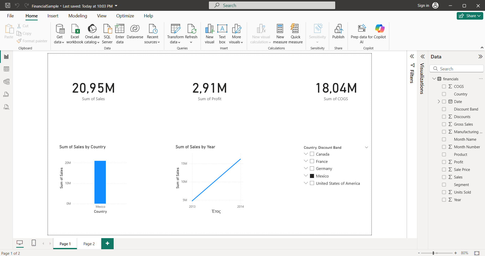
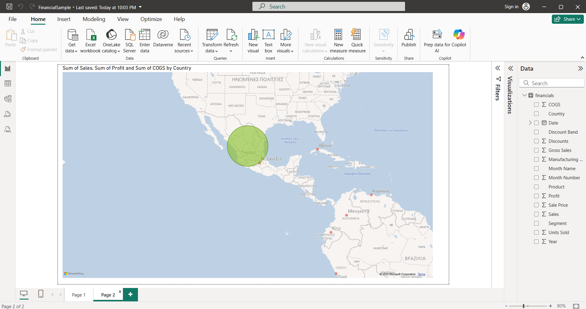
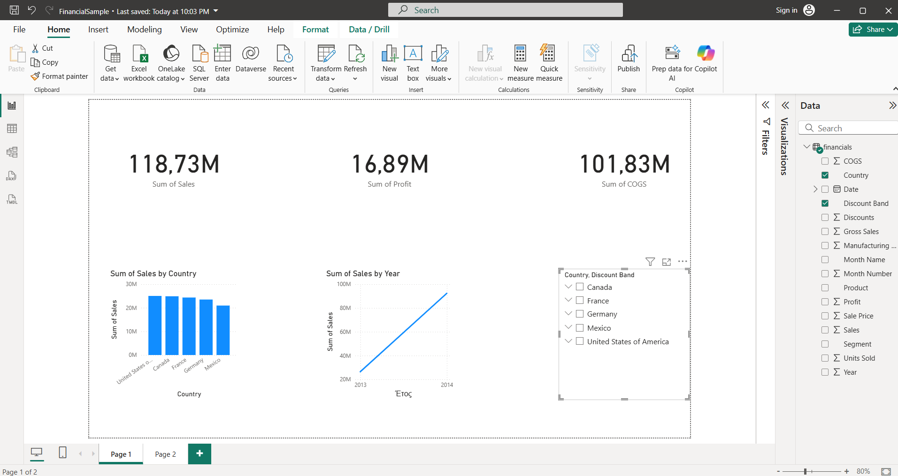
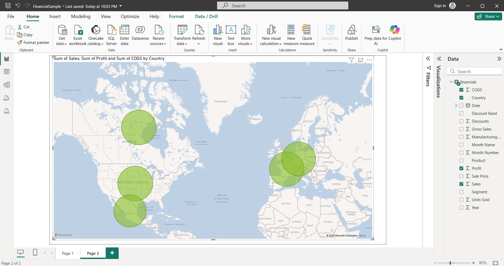

# PowerBI_Financials
Interactive Power BI dashboard demonstrating KPIs, charts and with synced slicers

## Overview
This is a small Power BI project, using an Excel financial dataset.  
The dashboard includes:

- **KPI cards** showing total Sales, Profit, and COGS  
- **Charts** for Sales by Country and Sales by Year  
- **A Map view** with sales bubbles by country  
- **Slicers** for Country and Year, synced across pages  

## Purpose
I created this  to practice working with Power BI.  
Through this project, I focused on:

- Importing and visualizing data from Excel  
- Checking data accuracy and interactivity between visuals  
- Applying a basic testing mindset to verify results  
- Understanding where reporting fits into the software development process (SDLC)

## Usage
1. Download the `.pbix` file.  
2. Open it in **Power BI Desktop**.  
3. Use the slicers to explore the data interactively.
4. The images below are depicting Mexico data exclusively
 
 
 
 

 and the images below are depicting countries data collectively.

 

## Notes
- **Page 1**: Overview with KPIs and trend charts.  
- **Page 2**: Full-page map for geographic sales view.  
- The project uses simple visuals only — no DAX formulas or complex relationships — focusing on reporting and validation.

## Skills Highlighted
- Power BI reporting and visualization  
- Data validation and testing  
- Familiarity with Excel data sources  
- Understanding of SDLC and QA practices  

## QA Example (Jira)
Sample tickets demonstrating bug tracking and test documentation.

**Ticket Examples:**  

**Description for Sales KPI card:**  

---

Built this project to strengthen my Power BI skills and demonstrate an analytical and testing-focused approach.
